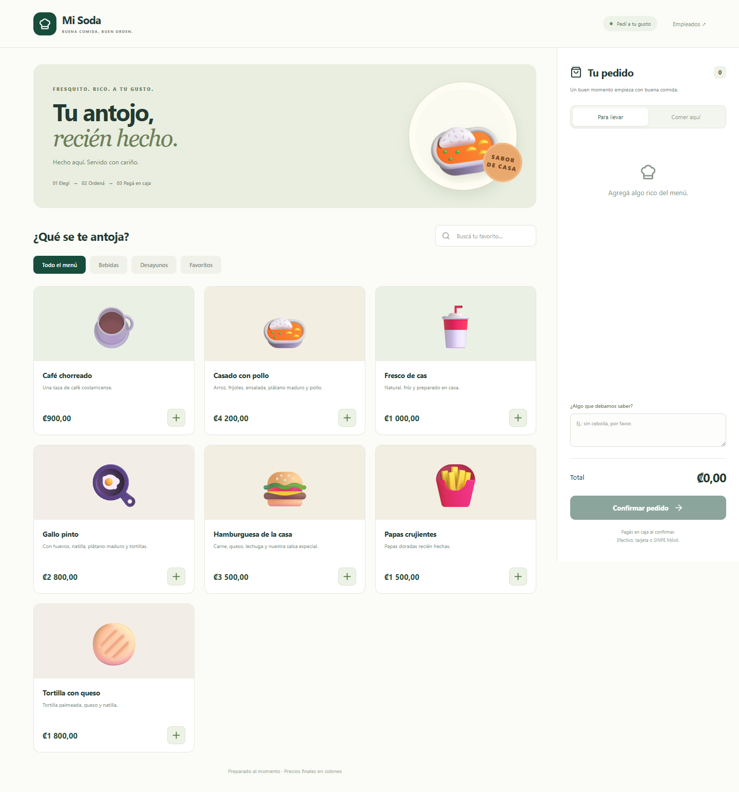
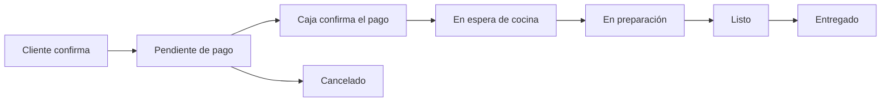
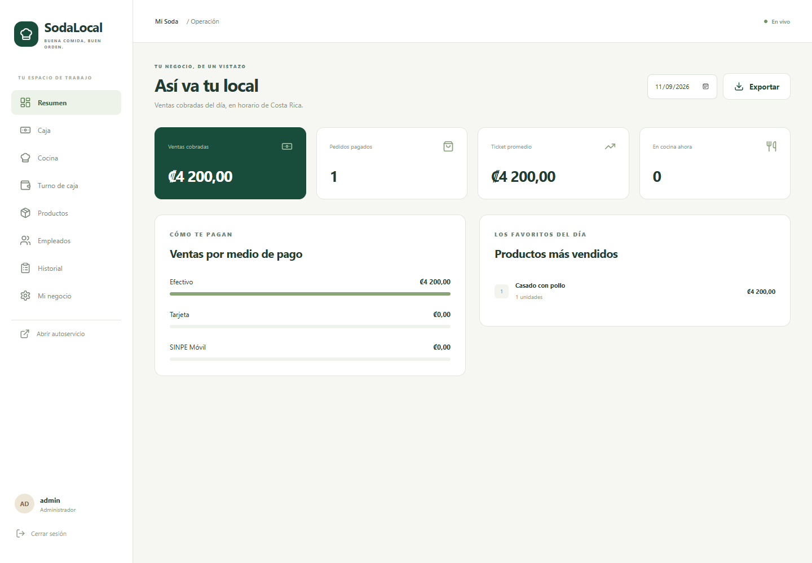
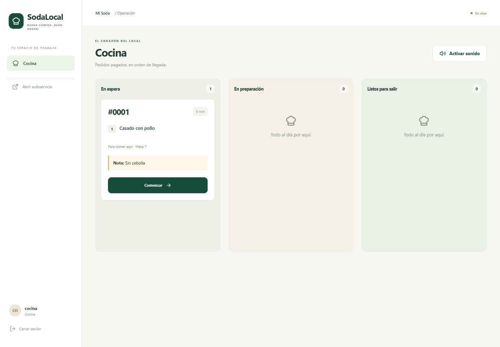
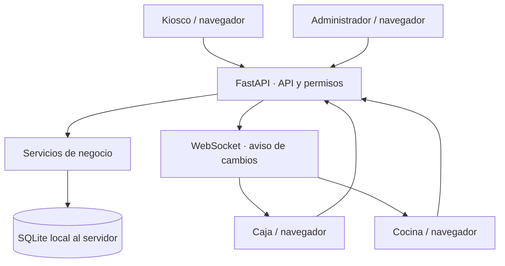

# SodaLocal

**Pedidos, caja y cocina para sodas, restaurantes y negocios de comida rápida en Costa Rica.**

SodaLocal permite que el cliente arme su pedido en una pantalla de autoservicio, pague en caja y reciba su comida mediante un flujo coordinado con cocina. El administrador gestiona el menú, los empleados y las ventas desde la misma aplicación.

Funciona con **React + TypeScript, FastAPI y SQLite**. Se puede ejecutar en la computadora del local o desplegar en un servidor en la nube.

> **Estado:** versión inicial funcional (0.1.0). Probada en Windows con SQLite y navegador Microsoft Edge. Incluye preparación para contenedores; todavía no se ha desplegado ni validado en AWS o Azure.



## Una aplicación, dos formas de operar

| Modalidad | Dónde vive el servidor | Conectividad para operar | Datos |
| --- | --- | --- | --- |
| Local / on-premise | PC del administrador | Red local por cable o Wi-Fi | SQLite en el disco de esa PC |
| Nube | Servidor del negocio en AWS, Azure u otro proveedor | Internet en los dispositivos | SQLite en disco persistente del servidor |

La instalación inicial descarga dependencias. Después, la modalidad local no necesita internet para el flujo de pedidos, caja y cocina. Las imágenes ilustrativas, íconos, estilos y código se sirven localmente.

**La modalidad nube no incluye funcionamiento sin internet ni sincronización local-nube.** Mantiene la misma interfaz y reglas de negocio, pero necesita conexión al servidor.

Con SQLite, esta versión utiliza **una instancia y un proceso de servidor por negocio**. No debe compartirse el archivo de base de datos mediante una carpeta de red ni entre réplicas de la aplicación.

## Qué incluye

### Autoservicio

- Menú por categorías, búsqueda y precios en colones.
- Carrito con cantidades y total.
- Pedidos para llevar o comer aquí, mesa opcional y notas para cocina.
- Número de pedido para pasar a caja.
- Reintentos seguros: una solicitud repetida conserva el pedido original.
- Diseño adaptable a computadoras, tabletas y teléfonos.

### Caja

- Consulta de pedidos pendientes de pago.
- Efectivo, tarjeta y SINPE Móvil.
- Cálculo de vuelto y referencia opcional para pagos electrónicos.
- Envío a cocina al confirmar el pago.
- Protección contra cobros duplicados, incluso con dos cajeros.
- Cancelación de pedidos que todavía no se han pagado.
- Apertura y cierre de caja: fondo inicial, efectivo esperado, efectivo contado y diferencia.
- Una caja compartida por local y registro del empleado que cobra.

### Cocina

- Solo recibe pedidos pagados.
- Tablero con columnas: en espera, en preparación y listos.
- Estados consecutivos hasta la entrega.
- Cantidades, notas, modalidad de servicio y mesa.
- Tiempo desde la creación del pedido y aviso sonoro opcional.
- Actualización por WebSocket y consulta periódica de respaldo.

### Administración

- Acceso a todas las áreas.
- Creación y edición de productos, categorías, precios y disponibilidad.
- Gestión de empleados, perfiles, contraseñas y desactivación de cuentas.
- Nombre del local, frase del menú, teléfono, dirección y número SINPE.
- Ventas diarias, ticket promedio, productos más vendidos y totales por medio de pago.
- Exportación de ventas en CSV.
- Historial de pedidos y actividad del negocio.
- Respaldos manuales y automáticos de SQLite.

Los reportes usan horario de **Costa Rica (UTC−6)**. Los importes se almacenan como enteros en céntimos; por ejemplo, ₡1 250,50 se guarda como `125050`.

## Perfiles

| Acción | Cliente | Caja | Cocina | Admin |
| --- | :---: | :---: | :---: | :---: |
| Consultar menú y crear pedido | ✓ | ✓ | ✓ | ✓ |
| Cobrar y cancelar pedidos sin pagar | | ✓ | | ✓ |
| Abrir y cerrar caja | | ✓ | | ✓ |
| Preparar, marcar listo y entregar | | | ✓ | ✓ |
| Gestionar productos y empleados | | | | ✓ |
| Ver reportes, auditoría y respaldos | | | | ✓ |

Los permisos se validan en el servidor. Ocultar una pantalla no es el mecanismo de seguridad.

## Flujo del pedido



El estado del pago se guarda separado del estado de preparación. Registrar el pago y habilitar cocina sucede en una sola transacción. Cambiar el precio de un producto no modifica pedidos ya creados.

## Inicio rápido en Windows

### Requisitos

- Python **3.12 o superior**; verificado con Python **3.14**.
- Node.js **22 o superior**; verificado con Node.js **24**.
- Un navegador actualizado.
- Conexión a internet para instalar las dependencias.

### 1. Instalar

Descargá o cloná el repositorio y ejecutá:

```powershell
.\Instalar.cmd
```

También podés hacer doble clic en **Instalar.cmd**. Crea un entorno de Python dentro del proyecto, instala las dependencias y compila la interfaz.

### 2. Iniciar y crear el administrador

```powershell
.\Iniciar.cmd
```

La primera vez solicita:

1. Nombre del usuario administrador.
2. Contraseña de al menos 10 caracteres.
3. Confirmación de la contraseña.

No existen cuentas de producción ni contraseñas predeterminadas. Al escribir la contraseña en la consola, los caracteres no se muestran.

El arranque agrega un menú de ejemplo si el catálogo está vacío. Podés editarlo desde **Productos**.

### 3. Abrir la aplicación

- Autoservicio: [http://localhost:8000](http://localhost:8000)
- Empleados: [http://localhost:8000/#/staff](http://localhost:8000/#/staff)
- Documentación de API: [http://localhost:8000/docs](http://localhost:8000/docs)
- Estado del servidor: [http://localhost:8000/api/health](http://localhost:8000/api/health)

Mantené abierta la ventana del servidor. Para detenerlo, presioná **Ctrl+C**.

### 4. Conectar caja, cocina y kiosco por red local

Usá la dirección IP de la PC servidor. Por ejemplo, si es `192.168.1.50`:

```text
Autoservicio: http://192.168.1.50:8000
Empleados:   http://192.168.1.50:8000/#/staff
```

Los equipos deben poder comunicarse entre sí. Configurá una IP reservada en el router, evitá la suspensión de la PC servidor y permití el puerto 8000 en el firewall únicamente para la red de trabajo que corresponda.

Para una instalación permanente, usá una red controlada y HTTPS para proteger las credenciales en tránsito. La PC servidor es necesaria mientras el local opera.

### 5. Configuración del negocio

Ingresá como administrador:

1. **Mi negocio:** nombre y número SINPE.
2. **Productos:** categorías, productos, precios finales y disponibilidad.
3. **Empleados:** cuentas individuales para caja y cocina.
4. **Turno de caja:** fondo inicial antes de cobrar.

## Capturas

### Administración



### Cocina



Las capturas usan un menú y operaciones de demostración. No contienen ventas reales.

## Arquitectura y clean code



La interfaz y la API se sirven desde el mismo origen. Los navegadores nunca abren directamente SQLite.

```text
SodaLocal/
├── backend/
│   ├── app/
│   │   ├── api.py              # Endpoints y permisos
│   │   ├── config.py           # Configuración del despliegue
│   │   ├── database.py         # Transacciones, conexiones y respaldos
│   │   ├── domain.py           # Roles, estados y reglas compartidas
│   │   ├── models.py           # Persistencia SQLAlchemy
│   │   ├── schemas.py          # Validación de solicitudes
│   │   ├── security.py         # Contraseñas y sesiones
│   │   ├── realtime.py         # Notificación de cambios
│   │   ├── services/           # Pedidos, catálogo, caja y empleados
│   │   ├── cli.py              # Configuración inicial y respaldo
│   │   └── main.py             # Composición y ciclo de vida
│   └── tests/                 # Pruebas de integración
├── frontend/
│   ├── src/
│   │   ├── components/         # Componentes compartidos
│   │   ├── lib/                # Cliente HTTP, hooks y formato monetario
│   │   ├── pages/              # Vistas por función
│   │   └── types.ts            # Contratos de la interfaz
│   └── tests/                 # Flujo completo con Playwright
├── scripts/                   # Instalación, arranque y verificación
├── docs/                      # Arquitectura, despliegue y capturas
├── Dockerfile
└── compose.yaml
```

Buenas prácticas aplicadas:

- Servicios pequeños agrupados por responsabilidad y endpoints sin reglas monetarias.
- Validación de entrada y permisos en el servidor.
- Contratos TypeScript y nombres explícitos.
- Importes enteros y precios históricos por línea de pedido.
- Transacciones SQLite con bloqueo adquirido antes de leer para escribir.
- Restricciones en la base de datos y claves únicas para idempotencia.
- Contraseñas derivadas con PBKDF2, sal aleatoria y comparación constante.
- Tokens de sesión aleatorios; la base guarda su hash y caducidad.
- Cierre de sesiones al cambiar contraseña, perfil o estado de la cuenta.
- Auditoría de operaciones y pruebas de comportamiento.

La capa de servicios usa SQLAlchemy directamente: la estructura es modular y evita una capa de repositorios que solamente repita sus métodos. No se presenta como una implementación estricta de Clean Architecture.

Más detalles en [Arquitectura](docs/ARQUITECTURA.md).

## Desarrollo

Instalá primero con `Instalar.cmd`. Para agregar herramientas de desarrollo:

```powershell
.\.venv\Scripts\python.exe -m pip install -e "./backend[dev]"
```

Servidor durante desarrollo:

```powershell
.\.venv\Scripts\python.exe -m uvicorn app.main:app --reload --host 127.0.0.1 --port 8000
```

En otra terminal:

```powershell
cd frontend
npm run dev
```

Vite redirige `/api` y WebSocket al servidor local. Para operar el restaurante se usa la interfaz compilada y **un solo proceso**, sin `--reload`.

## Pruebas

Verificación completa en Windows:

```powershell
powershell -NoProfile -ExecutionPolicy Bypass -File .\scripts\check.ps1
```

Incluye:

- Ruff: formato y revisión estática.
- **24 pruebas de integración**: permisos, estados, concurrencia, idempotencia, caja, precios históricos, respaldos y exportación.
- Compilación TypeScript y Vite.
- **Una prueba de extremo a extremo** en navegador que recorre autoservicio, caja, cocina, cierre, administración y pantalla móvil.

Playwright usa Microsoft Edge en Windows. En otro entorno instalá Chromium con `npx playwright install --with-deps chromium`; podés elegir el canal con `PLAYWRIGHT_CHANNEL` y el ejecutable de Python con `PYTHON_BIN`.

Las cuentas de prueba se crean únicamente en bases nuevas dentro de `data/e2e/`. Estas bases, los resultados y las credenciales de prueba no se usan en producción. El código de prueba sí incluye contraseñas ficticias para sus propias cuentas.

## Seguridad y puertos

Consultá [Seguridad](SECURITY.md) para saber qué puertos escucha la aplicación, durante cuánto tiempo, cómo restringir la red y qué protecciones quedan a cargo de la instalación. Publicar el código no publica la base de datos ni pone el servidor en internet.

## Datos y respaldos

Por defecto:

```text
data/soda.sqlite3
data/backups/
```

- Respaldo manual: **Mi negocio → Crear respaldo ahora**.
- Respaldo por consola:

```powershell
.\.venv\Scripts\python.exe -m app.cli backup
```

- Respaldo automático diario mientras el servidor corre, comprobado cada hora.
- Se usa la API de respaldo de SQLite, compatible con la base en uso.
- Los respaldos incluyen información del negocio y deben tener el mismo control de acceso.
- Las copias guardadas en el mismo disco no protegen contra la pérdida de ese disco: replicalas a otra unidad o almacenamiento.
- Esta versión no elimina automáticamente respaldos antiguos.

Ver [Operación y despliegue](docs/DESPLIEGUE.md) para restauración y traslado.

## Contenedores y nube

```bash
docker compose build
docker compose run --rm sodalocal python -m app.cli init --demo
docker compose up -d
```

Por defecto Compose publica solo en localhost. Para acceso directo desde la LAN, configurar SODA_BIND con la IP local del servidor y sus controles de red. El volumen `soda-data` conserva SQLite y los respaldos. La creación del administrador es interactiva.

Configuración por variables:

| Variable | Uso |
| --- | --- |
| `SODA_DATABASE` | Ruta del archivo SQLite en disco persistente |
| `SODA_STATIC` | Ruta de la interfaz compilada; útil para instalaciones empaquetadas |
| `SODA_BIND` | Solo Compose: IP del host donde publicar el puerto, localhost por defecto |

Para AWS/Azure, la propuesta inicial es una VM o un contenedor **con una sola instancia y almacenamiento persistente**, HTTPS y acceso controlado. No usar disco efímero para SQLite ni escalar a varias réplicas compartiendo ese archivo.

El contenedor está preparado en el repositorio; **no ha sido ejecutado aquí porque Docker no está instalado**. El despliegue real y la validación del almacenamiento del proveedor quedan pendientes.

## Alcance actual y siguientes etapas

Esta versión registra ventas y su operación; aún no incluye:

- Facturación electrónica ni integración con Hacienda.
- Cobro automático con tarjetas o validación bancaria de SINPE.
- Devoluciones, pagos divididos, retiros de caja y gastos.
- Combos, modificadores cobrables, descuentos o cupones.
- Inventario de ingredientes, recetas y proveedores.
- Carga de fotografías e impresión de tickets térmicos.
- Varias sucursales o varios negocios dentro de una misma instalación.
- Operación híbrida con sincronización entre servidor local y nube.
- Instalador firmado, servicio de Windows o actualizaciones automáticas.
- Migraciones incrementales para futuras versiones del esquema.

Tarjeta y SINPE se confirman manualmente en caja. Los precios del catálogo son precios finales; no existe desglose fiscal en esta versión.

## Licencia

La licencia de distribución del proyecto está pendiente de definición por su propietario. No se incluye una licencia de código abierto en esta entrega. Las dependencias mantienen sus propias licencias.


